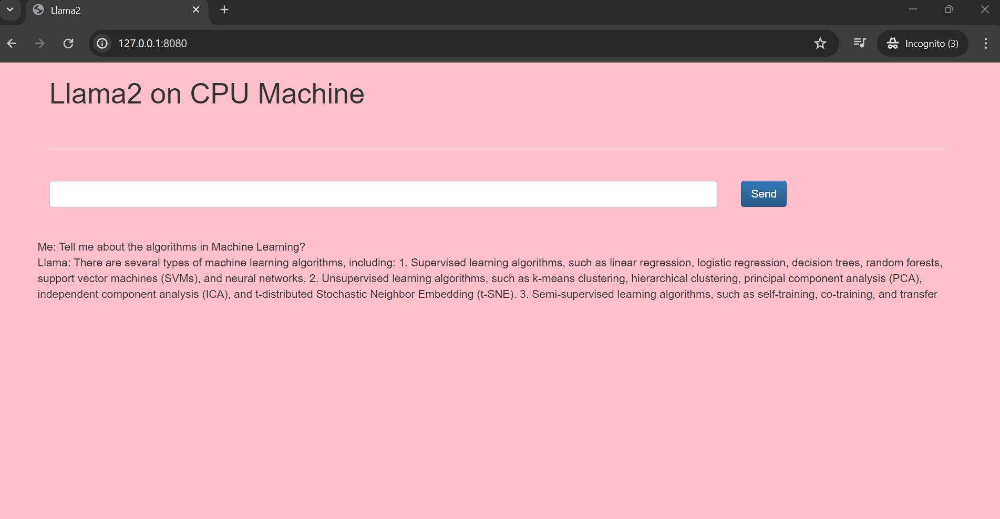

# Chatbot Using Retrieval Question Answering Using Llama2 on CPU Machine

This project implements a chatbot using Retrieval Question Answering (QA) techniques. The chatbot is built using Flask, LangChain, and Hugging Face Transformers.

## Overview
The chatbot retrieves answers from a pre-processed set of documents using a retrieval-based QA model. It accepts user questions and returns relevant answers from the document corpus.

### Installation
1. Clone the repository:
```
git clone https://github.com/your_username/your_repository.git
```

2. Create a virtual environment:

```
conda create -n cpullama python=3.8 -y
conda activate cpullama
pip install -r requirements.txt
```

3. Download the quantize model and place it in the model/ directory.
```
## Download the Llama 2 Model:

llama-2-7b-chat.ggmlv3.q4_0.bin


## From the following link:
https://huggingface.co/TheBloke/Llama-2-7B-Chat-GGML/tree/main
```

4. Place your PDF documents in the data/ directory for the chatbot to retrieve answers from.

## Tools Used
* Flask: Web framework used for building the chatbot interface.
* LangChain: Python library for natural language processing tasks such as document retrieval and question answering.
* Hugging Face Transformers: Library providing pre-trained models and tools for natural language understanding tasks.
* FAISS: Library for efficient similarity search and clustering of dense vectors.
* PyPDF2: Library for reading and extracting text from PDF files.

## Usage
1. Run the Flask app:

```
python app.py
```
2. Access the chatbot interface through your web browser at http://localhost:8080.

3. Enter your questions in the input field and click "Submit" to receive answers from the chatbot.

## Screenshot:

